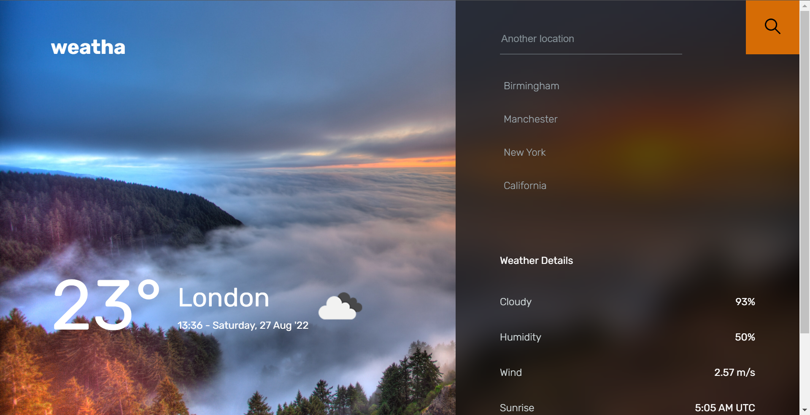
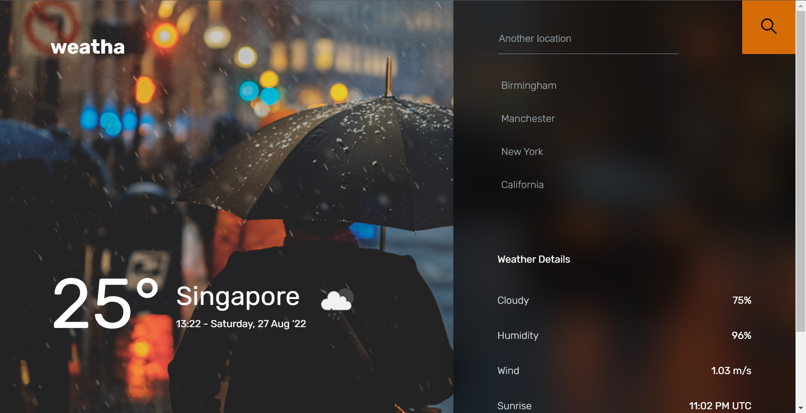

# weatha

## Table of Contents

- [About](#about)
- [Getting Started](#getting_started)
- [Acknowledgements](#acknowledgements)

## About <a name = "about"></a>

This is a weather application made using ReactJS. This is my first react project.



## Getting Started <a name = "getting_started"></a>

These instructions will get you a copy of the project up and running on your local machine for development and testing purposes.

### Prerequisites

Install the required packages.

```
npm install
```

### Installing

Create a `.env` file in your root project directory, and assign the variable `REACT_APP_OPENWEATHERMAP_API_KEY` to your OpenWeatherMap API key.

To run the app in development mode, you will need to run the following command:

```
npm start
```

## Acknowledgements <a name = "acknowledgements"></a>

[Design Inspiration](https://dribbble.com/shots/7118235-Weather-DailyUI-037/attachments/121070?mode=media)

[Background Images](https://unsplash.com/)
